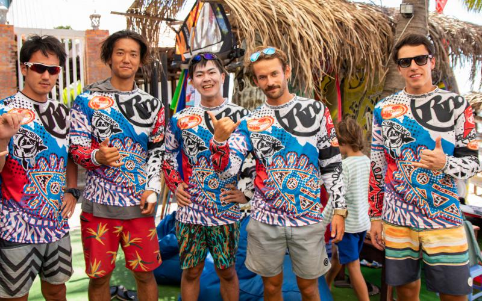

### Описание

Всем привет, меня зовут Эдуард, я eврей, программист, серфер, искатель(приключений и истины). Представляю вам первый выпуск своего подкаста, в котором я хочу немного познакомить слушателя с автором.

Я думаю, что если любой из нас посмотрит на себя в зеркало и поразмышляет на тему "Каким образом на мне оказались вещи которые я вижу?", то эти размышления могут натолкнуть на пару тройку интересных историй из жизни, попробуйте как-нибудь - это интересно, главное не останавливаться на "Ну это я купил в магазине возле трамвайной остановки", попробуйте зайти немного дальше. Собственно из таких размышлений и родился этот выпуск, одну из таких историй вы можете услышать, а еще несколько прочитать. Меня часто называют хипстером, хотя большинство вещей которые я вижу когда смотрю зеркало оказались на мне каким-то случайным образом, отсюда повилось название этого выпуска.

Этой мой первый эксперимент в таком жанре поэтому не судите строго!!!

## 1. Носки

Сегодня сложно встретить хипстера без каких-нибудь желтых носков с рыбками или розовых с пельменями и я этому не исключение. Однако в моей жизни так было далеко не всегда. Более того все изменилось резко в один день, день когда я случайно пошел в магазин за вещами с самым настоящим профессиональным стилистом. Это был мой первый опыт покупки вещей со стилистам и теперь я знаю как это работает. Ты идешь в магазин за обычными джинсами, а выходишь с новой яркой гавайской рубашкой и цветастыми носками. Ни то ни другое ты сам никогда в жизни бы себе не купил, но при этом выходишь из магазина ты с полной уверенностью что шел в магазин именно за ними. Судя во всему, настоящий стилист знает что тебе нужно лучше чем ты сам.

  
  <figcaption>Стилист уже надо мной поработал</figcaption>

Я думаю что то как мы выглядим отражает то кем мы являемся, после этого похода я стал одеваться ярче и как ни странно жизнь моя тоже стала ярче, сложно сказать насколько это может быть связанно, я думаю что вполне. В любом случае я благодарен стилисту за то что он повлиял на мою жинзь.

  
  <figcaption>Мои любимые носки</figcaption>

## 2. Очки

Очки эти я случайно я нашел в каком-то баре на магическом острове Ко-Панган в Тайланде. Нашли мы их вместе с девчонкой по имени Рокси, с которой я там познакомился в лагере тайского бокса. Она мне тогда сказала, что эти очки отлично подходят к моей гавайской рубашке. Они правда совсем не защащали от солнца, но своим розоватым оттенком как-будто делали мир немного ярче и красивее.

  
  <figcaption>Рокси справа на фото, в повязке на голове, а я в тех самых очках</figcaption>

Каждый раз когда я вижу эти очки я вспоминаю о Рокси. Рокси - супер клевая девчонка из Амстердама, и она мне очень нравилась впервую очередь как человек, и только во вторую как очаровательная женщина. Она навсегда останется в моем сердце потому что именно она, сама того не подозревая, научила меня танцевать трезвым. Я всегда завидовал людям которые так умеют, а Рокси как раз была одной из таких. Долгие годы я думал что овладеть этим навыком мне уже не по силам, поэтому приходилось использовать немалое колличество алкоголя чтобы делать это посреди толпы на всяких вечеринках и тусовках. Раньше я думал что ходил на такого рода мероприятия чтобы занкомиться с дамочками, но сейчас я думаю что больше всего мне там нравилось именно танцевать. Примерно 26 лет мне понадобилось чтобы понять, что я просто обожаю танцы.

Короче говоря, Рокси меня вдохновила, я решил что хочу быть как она и танцевать как хочу и где хочу, так же как я все это время делал дома, пока никто не видит. Со временем чакра танцев в моей душе раскрылась навсегда, теперь я свободен и могу танцевать везде без всяких допингов, только бы музыка была хорошая. Спасибо тебе Рокси за вдохновение!

  <iframe src="https://vk.com/video_ext.php?oid=2816774&id=137695606&hash=ee85a935e986f3f8" width="640" height="360" frameborder="0" allowfullscreen></iframe>
  <figcaption>Вспомнил что когда-то все таки умел танцевать трезвым, 11-ый класс новгоднее выступление, мои танцы начинаются в 2-50</figcaption>

## 3. Браслеты

<iframe height="200px" width="100%" frameborder="no" scrolling="no" seamless src="https://player.simplecast.com/446d30c7-5443-4840-bcf6-65e7966aba25?dark=true"></iframe>

  

Вот столько примерно нужно браслетов, чтобы очистить океан от пластика,
который туда попадает в течение одного дня. Браслет кстати прикольный, и мешочек мне очень понравился. На самом деле я этот браслет почти сразу же потерял, но в итоге мне по ошибке прислали два, даже не знаю, могу ли я теперь говорить, что я очистил океан от 2 фунтов мусора? Если тоже хотите повлиять на целый океан, идите на [4ocean](https://bit.ly/3dJ3jXr), у них там много разных браслетов.

<iframe width="560" height="315" src="https://www.youtube.com/embed/PJ5AEoO0cNM" frameborder="0" allow="accelerometer; autoplay; encrypted-media; gyroscope; picture-in-picture" allowfullscreen></iframe>

Выше видео с соревнований, если не открывается можно глянуть по <a href="https://www.youtube.com/watch?v=PJ5AEoO0cNM&feature=emb_logo" target="_blank">ссылке</a>.

  

  
  <figcaption>Справа на фото побетидель среди любителей</figcaption>

  
  <figcaption>Отмечаем достойное поражение. Фото сделанно на 3-ий день одной из самых диких тусовок в моей жизни. То что было в Муйне остается в Муйне.</figcaption>

## 4. Куртец

  

Эту куртку я купил в Англии когда ездил туда навестить своего хорошего друга, Андрюху. И это была знаковая поездка для меня, потому что тогда произошло одно событие которые достаточно сильно повлияло на мою жизнь. Произошло это в день когда я поехал смотреть Стоунхендж.

  
  <figcaption>Это Стоунхендж</figcaption>

  
  <figcaption>Это Стоунхендж и я</figcaption>

Стоунхендж — это древний мегалит, овеянный тайнами и легендами, расположенный на юге Англии в 130 км от Лондона. Это комплекс из 30 грубо обтесанных огромных столбов и плит из камня, поставленных друг на друга в концентрических кругах. Назначение Стоунхенджа до сих пор до конца не разгадано учеными: одни считают его храмом, другие — астрономической обсерваторией, некоторые — гробницей, а легенды говорят о том, что здесь совершали ритуалы атланты, гиперборейцы и знаменитый волшебник Мерлин.

Не знаю может духи этого места мне нашептали может просто так совпало, но как только я покинул эти древние каменные развалины по дороге домой, посреди бесконечного потока мыслей который как обычно кипел и бурлил в моей голове, как гром посреди ясного неба я услышал голос обращенный к самому себе - "Эдик, пришло время тебе делать свой подкаст." И это было начало какого-то нового интересного пути в моей жизни.

> Любой путь — это всего лишь путь, и нет никакой абсолютно преграды ни для тебя самого, ни для других, чтобы бросить его, если именно это велит тебе сделать твое сердце.

---

## Credits

Podcast Artwork by [Tanya Tsaur/ Pastushkova](https://bit.ly/39yVBf9)

Картинка в начале [Raphael Shochat](https://bit.ly/2UWly3f)

**Music**

Running Away by Rafael Krux
Link: [https://filmmusic.io/song/5312-running-away-](https://filmmusic.io/song/5312-running-away-)
License: [http://creativecommons.org/licenses/by/4.0/](http://creativecommons.org/licenses/by/4.0/)

Man Down by Kevin MacLeod
Link: [https://incompetech.filmmusic.io/song/4016-man-down](https://incompetech.filmmusic.io/song/4016-man-down)
License: [http://creativecommons.org/licenses/by/4.0/](http://creativecommons.org/licenses/by/4.0/)
