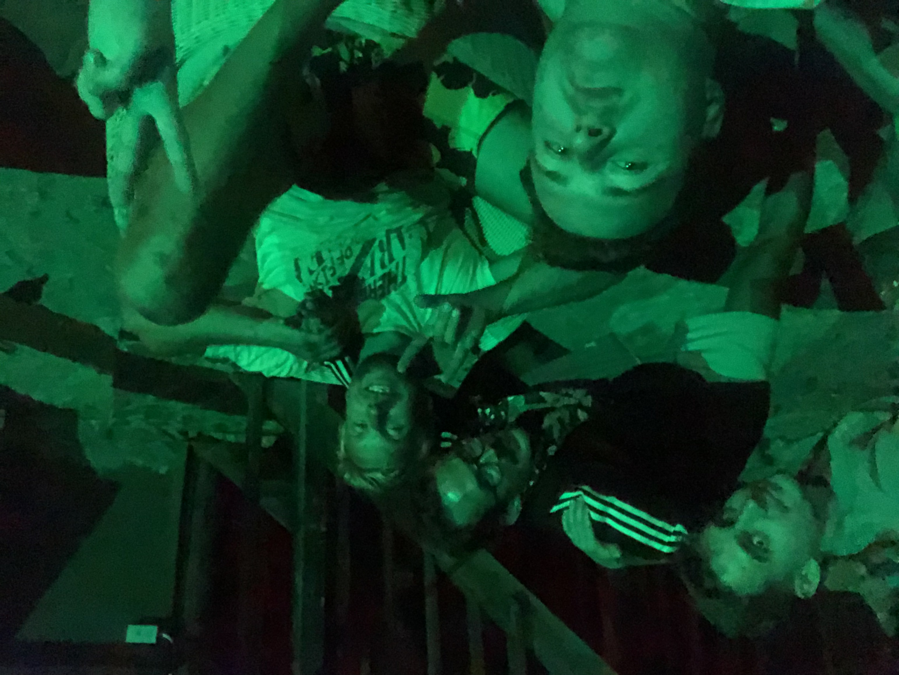

<!-- ### Links -->

<!-- _(тут будут ссылки на всякие места где можно слушать подкасты)_ -->

<!-- [Apple Podcasts](https://www.google.com) -->

<!-- [Google Podcasts](https://www.google.com "Google's Homepage") -->

<iframe height="200px" width="100%" frameborder="no" scrolling="no" seamless src="https://player.simplecast.com/996407b9-018f-4024-b6a8-b61ecbb5d8f7?dark=true"></iframe>

### Примечание к предисловию

Предисловие было записано примерно за час до самого последнего крайнего-прекрайнего дедлайна выпуска подкаста который я сам конечно же себе поставил...

### Описание

Всем привет, я Эдик. С дрожью в руках и немного в голосе представляю вам первый выпуск своего подкаста. Он о в основном обо мне, но и о других тоже, о том что меня интересует и заботит - в общем обо всем. Несколько лет я думал что сёрфинг это моя жизнь и я больше никогда не смогу жить без моря и паруса, а ещё не так давно писал коды для новых сайтов. И хотя я считаю что программист очень творческая профессия (некоторым иногда приходится это объяснять) мое сердце позвало меня открывать новые творческие горизонты, а ему я уже не могу сопротивляться!

В своих исследованиях мира подкастинов я наткнулся на мир так называемых нарративных покдастов, это такие подкасты в которых рассказываются истории, обычно это реальные истории из жизни людей. Неожиданно для самого себя, первый мой экспериментальный выпуск будет именно в этом жанре. Я решил что прежде чем брать на себя ответсвенность за истории других, нужно поэкспериментировать немного на себе, поэтому тут будут истории основанные на рельных событиях из моей жизни. Хочу отдельно отметить, что в этих историях нет никаких намерений кого-то чему-то научить или что-то кому-то навязать, все это просто творческий эксперимент и проверка своих идей, так что встречайте и включайте, строго не судите!_(Начинайте со вступления)_

## 1. Носки

_To be continued..._

## 2. Очки

_To be continued..._

## 3. Браслеты

<iframe height="200px" width="100%" frameborder="no" scrolling="no" seamless src="https://player.simplecast.com/446d30c7-5443-4840-bcf6-65e7966aba25?dark=true"></iframe>

  

Вот столько примерно нужно браслетов, чтобы очистить океан от пластика который туда попадает в течении одного дня. Браслет кстати прикольный, и мешочек мне очень понравился. На самом деле, я этот браслет почти сразу же потерял, но в итоге мне по ошибке прислали два, даже не знаю могу ли я теперь говорить что я очистил океан от 2 фунтов мусора? Если тоже хотите повлиять на целый океан идите на [4ocean](https://bit.ly/3dJ3jXr) у них там много разных браслетов.

<iframe width="560" height="315" src="https://www.youtube.com/embed/PJ5AEoO0cNM" frameborder="0" allow="accelerometer; autoplay; encrypted-media; gyroscope; picture-in-picture" allowfullscreen></iframe>

Выше видео с соревнований, если не открывается можно глянуть по <a href="https://www.youtube.com/watch?v=PJ5AEoO0cNM&feature=emb_logo" target="_blank">ссылке</a>.

  

  
  <figcaption>Справа на фото побетидель среди любителей</figcaption>

  
  <figcaption>Отмечаем достойное поражение. Фото сделанно на 3-ий день одной из самых диких тусовок в моей жизни. То что было в Муйне остается в Муйне.</figcaption>

## 4. Куртец

_To be continued..._

---

## Credits

Podcast Artwork by [Tanya Tsaur/ Pastushkova](https://bit.ly/39yVBf9)

Картинка в начале [Raphael Shochat](https://bit.ly/2UWly3f)

**Music**

Running Away by Rafael Krux
Link: [https://filmmusic.io/song/5312-running-away-](https://filmmusic.io/song/5312-running-away-)
License: [http://creativecommons.org/licenses/by/4.0/](http://creativecommons.org/licenses/by/4.0/)

Man Down by Kevin MacLeod
Link: [https://incompetech.filmmusic.io/song/4016-man-down](https://incompetech.filmmusic.io/song/4016-man-down)
License: [http://creativecommons.org/licenses/by/4.0/](http://creativecommons.org/licenses/by/4.0/)
