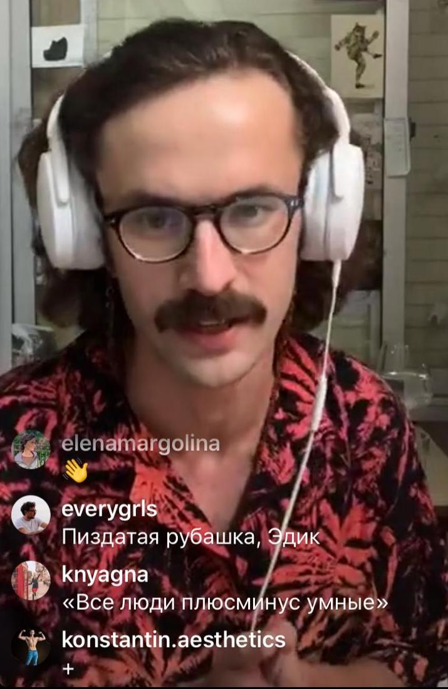
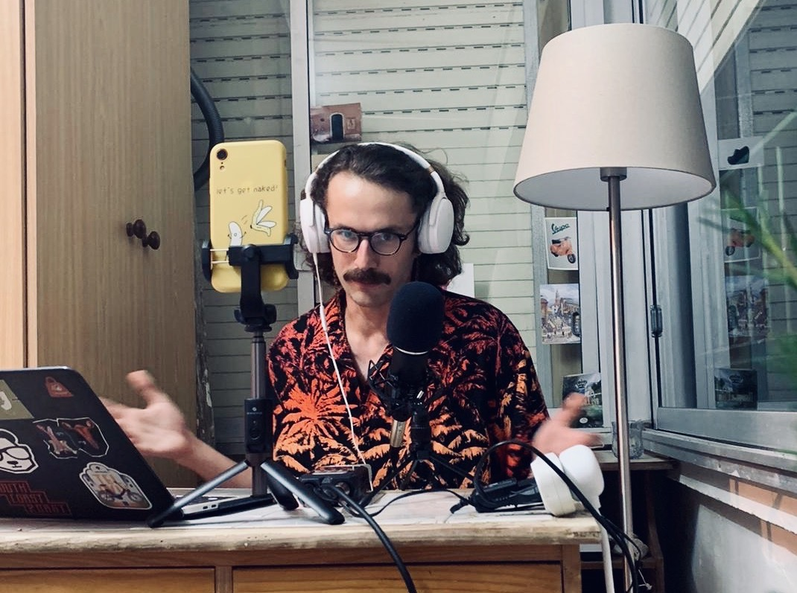

Вчера я проводил свой первый прямой эфир в Инстаграме, спасибо всем кто пришел поддержать. Я рад что сделал это, но прошло все не так гладко как я планировал. Этот пост я решил написать для той версии себя, которая еще не успела провести этот прямой эфир, и который мог бы ей с этим помочь. Если у вас в планах нет никаких прямых эфиров и вы думаете что вам это совсем не интересно, я бы на вашем месте не спешил с выводами, года полтора назад я не то что о прямых эфирах не думал, у меня даже Инстаграма не было. Поэтому как минимум сохраните себе на будущее. Кроме того отчасти те вещи о которых пойдет речь, применимы к первым шагам и в других начинаниях.

### Первый блин комом

Да я знаю, банально и все об этом знают, и я об этом знаю, но тем не менее, я почему-то не перестаю об этом забывать. Может после того как напишу получше запомню. Пора уже принять факт, когда делаешь что-то что никогда не делал, у тебя не получиться хорошо, у тебя просто не может получиться хорошо, да именно потому что ты этого еще никогда не делал. А если вдруг получиться хотя бы более менее нормально - ты уже сорвал джекпот и без помощи ангелов тут скорее всего не обошлось. Если получится не очень - это нормально, это часть пути, мы все это путь проходим. Второй раз скорее всего тоже будет комом, с третьего может уже будет чуть получше.

### Делай первый эфир как можно короче

Не затягивайте с этим. Чем длиннее будет ваш эфир, тем больше у вас будет пространства для того чтобы ошибиться, а вы будуте ошибаться,
напомню, это ПЕРВЫЙ прямой эфир. Оптимальное время 10-15 минут, этого более чем достаточно.

### Выбирай простую тему

Опять же исходя из первого пункта, берите тему как можно проще. Я человек склонный к усложнению всего в том что я делаю, поэтому сразу же решил задвигать эфир на сложные экзистенциальные темы. Я обожаю такие темы, но лучше бы я их оставил для следующих эфиров. Берите что-то простое, что-то с чем в сталкиваетесь каждый день. Самая лучшая тема - та, о которой вам есть что сказать даже без всякой подготовки.

### Проверяй интернет

Этот пункт оооочень важен. Самое плохое что может случиться во время эфира, это если будут перебои со связью. И конечно же это случилось во время моего первого эфира. Понятно что не все от нас зависит, но как минимум попробуйте перед тем как давать эфир позвонить кому-то в WhatsApp по видеосвязи, если связь хорошая скорее всего все будет нормально. Если нет, а эфир уже скоро попробуйте например переключиться с wi-fi на телефонный интернет, в современном мире он очень даже хорош.

### Отвечай только на те вопросы, на которые хочешь, а если не хочешь не отвечай

  

На вашим эфире главный человек это вы. Вы никому ничего не обязаны даже если это ваша мама(только в рамках прямого эфира конечно же). Отвечайте только на то, на что хотите, можно даже совсем не отвечать, для первого раза сойдет. И важный момент, читайте вслух только те вопросы на которые вы уже точно решили что хотите ответить, чтобы не оказаться в неловкой ситуации в которой оказался я.

### Всегда смотри в камеру

Важно понимать, если вы хоть на секунду перестаете смотреть в камеру, зритель сразу это чувствует. Я решил что будет проще, если со мной во время эфира будет немного живой аудитории. Возможно это была не самая лучшая идея, потому что взгляд постоянно автоматически искал контакта с людьми рядом со мной и тем самым я переставал смотреть в камеру.

### Не затягивай со вступлением

Я каким-то образом, сам того не замечая, растянул вступление минут на 7, опять же, мне повезло что слушали меня друзья, знакомые и родственники, и я их не потерял на этом моменте. 1-2 минут на вступление вполне достаточно.

### Проси фидбек

Как и в любой другой сфере Фидбек, самая важная часть. Только это может помочь вам сделать следующий эфир лучше. Во-первых, пересмотрите эфир(это тоже может быть непросто) и дайте себе его сами, и запишите все. Во-вторых, попросите кого-нибудь дать вам фидбек, для объективной оценки вашего выступления вам не нужен какой-то эксперт прямых эфиров, возьмите кого-то из вашей потенциальной аудитории, например вашего друга, попросите его выделить вам час времени, вытаскивайте из него все что можно, напоминаю, что фидбек - это конструктивная критика, на которую не нужно отвечать, а нужно принимать и уже дальше честно для себя решать, нужно ли вам что-то с этим делать или нет.

### Готовься! но не очень много

Я не буду много говорить о важности подготовки, это и так все знают, если не готовиться ничего хорошего точно не получиться. Но хочу отметить, что переусердствовать в этом вопросе тоже не стоит. После какого-то момента, особенно если мы говорим о чем-то что вы никогда не делали, соотношение трудозатрат на подготовку к выхлопу очень сильно падает. Вы пока еще не знаете себя в этом, не знаете свои слабые и сильные стороны, не знаете чему нужно больше уделить внимание, а чему меньше. Лучше поскорее перейти ко второму и третьему разу, и вложить больше сил туда.

### Оденься красиво

  

В последний момент я вместо застиранной черной футболки, натянул рубашечку. Зрителям понравилось, порадуйте и вы своих зрителей.

На этом все, и это основные моменты которая я для себя выделил утром на следующий день, после того как провел эфир. Друзья, не забывайте еще одну важную истину. Самый страшный ваш критик и враг это вы сами, если у вас получится справиться с ним это уже победа, мой опыт показывает, что на первых порах аудитория очень доброжелательная, может даже слишком, поэтому она многое прощает, и это значит что самое время пробовать себя . Удачи вам в ваших прямых эфирах и по всех ваших начинаниях!!!

#прямойэфир #лайф #онлайнтрансляция #публичныевысутпления #блог
